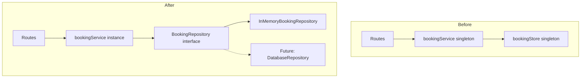

# Repository Pattern Refactor

## Architecture Overview



## 1. Define BookingRepository Interface ([src/types/index.ts](src/types/index.ts))

Add interface that defines the contract for any booking storage:

```typescript
export interface BookingRepository {
  create(booking: Booking): Booking
  findById(id: string): Booking | undefined
  findByRoom(roomId: string): Booking[]
  delete(id: string): boolean
  getAll(): Booking[]
  clear(): void
}
```

## 2. Rename and Refactor Storage ([src/storage/bookingStore.ts](src/storage/bookingStore.ts))

- Rename class `BookingStore` to `InMemoryBookingRepository`
- Implement `BookingRepository` interface
- Create factory function `createBookingRepository()`
- Keep backward-compatible export `bookingStore`
```typescript
import { Booking, BookingRepository } from '../types/index.js'

export class InMemoryBookingRepository implements BookingRepository {
  // ... existing implementation
}

// Factory function for creating new instances
export function createBookingRepository(): BookingRepository {
  return new InMemoryBookingRepository()
}

// Backward-compatible singleton export
export const bookingStore = createBookingRepository()
```


## 3. Define BookingService Interface and Factory ([src/services/bookingService.ts](src/services/bookingService.ts))

- Define `BookingService` interface
- Create `createBookingService(repo)` factory function
- Move overlap checking inside the factory closure
- Keep backward-compatible export `bookingService`
```typescript
export interface BookingService {
  createBooking(roomId: string, body: unknown): Booking
  getBookingsByRoom(roomId: string): Booking[]
  cancelBooking(bookingId: string): void
  getBookingById(bookingId: string): Booking | undefined
}

export function createBookingService(repository: BookingRepository): BookingService {
  // checkForOverlap uses the injected repository
  function checkForOverlap(roomId: string, newStart: Date, newEnd: Date): void {
    const existingBookings = repository.findByRoom(roomId)
    // ... overlap logic
  }

  return {
    createBooking(roomId, body) {
      // ... uses repository
    },
    // ... other methods
  }
}

// Backward-compatible singleton export
export const bookingService = createBookingService(bookingStore)
```


## 4. Update Routes ([src/routes/bookingRoutes.ts](src/routes/bookingRoutes.ts))

Create factory function for routes that accepts a service:

```typescript
export function createBookingRoutes(service: BookingService): Router {
  const router = Router()
  // ... routes use injected service
  return router
}

// Backward-compatible export using singleton
export const bookingRoutes = createBookingRoutes(bookingService)
```

## 5. Update App ([src/app.ts](src/app.ts))

Add optional dependency injection to `createApp()`:

```typescript
interface AppDependencies {
  bookingService?: BookingService
}

export function createApp(deps: AppDependencies = {}): Application {
  const service = deps.bookingService ?? bookingService
  const routes = createBookingRoutes(service)
  // ... wire up app
}
```

## 6. Update Unit Tests ([tests/booking.test.ts](tests/booking.test.ts))

Use fresh repository instances per test:

```typescript
describe('Booking Repository', () => {
  let repository: BookingRepository

  beforeEach(() => {
    repository = createBookingRepository()
  })

  it('should create and retrieve a booking', () => {
    repository.create(booking)
    expect(repository.findById('test-1')).toEqual(booking)
  })
})

describe('Booking Service - Overlap Detection', () => {
  let repository: BookingRepository
  let service: BookingService

  beforeEach(() => {
    repository = createBookingRepository()
    service = createBookingService(repository)
  })

  // Tests use fresh service instance
})
```

## 7. Update Integration Tests ([tests/api.test.ts](tests/api.test.ts))

Integration tests can continue using the singleton approach with `clear()`, or create fresh app instances:

```typescript
// Option A: Keep using singleton with clear (simpler)
beforeEach(() => {
  bookingStore.clear()
})

// Option B: Fresh instances per test (full isolation)
let app: Application
beforeEach(() => {
  const repo = createBookingRepository()
  const service = createBookingService(repo)
  app = createApp({ bookingService: service })
})
```

## Files Changed Summary

| File | Changes |

|------|---------|

| `src/types/index.ts` | Add `BookingRepository` and `BookingService` interfaces |

| `src/storage/bookingStore.ts` | Rename to `InMemoryBookingRepository`, add factory |

| `src/services/bookingService.ts` | Add `BookingService` interface and factory |

| `src/routes/bookingRoutes.ts` | Add `createBookingRoutes()` factory |

| `src/app.ts` | Add optional DI to `createApp()` |

| `tests/booking.test.ts` | Use fresh instances per test |

| `tests/api.test.ts` | Update to use DI or keep singleton with clear |

| `docs/PROMPTIT.md` | Add this prompt and response |

## Backward Compatibility

All existing code continues to work:

- `bookingStore` - singleton instance (unchanged API)
- `bookingService` - singleton instance (unchanged API)
- `bookingRoutes` - singleton router (unchanged API)
- `createApp()` - works without arguments (unchanged API)