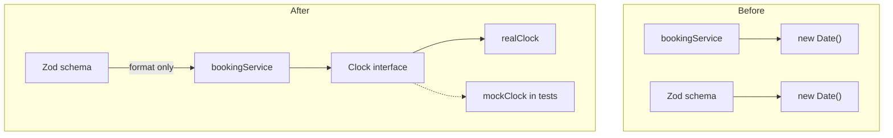

# Clock Abstraction for Deterministic Time Handling

## Architecture



## 1. Create Clock Interface ([src/utils/clock.ts](src/utils/clock.ts))

```typescript
export interface Clock {
  now(): Date
}

export const realClock: Clock = {
  now: () => new Date(),
}
```

## 2. Remove Past-Booking Validation from Schema ([src/schemas/bookingSchemas.ts](src/schemas/bookingSchemas.ts))

Remove the `.refine()` that checks `new Date(data.startTime) > new Date()`. The schema will only validate:

- Format (valid ISO-8601)
- Order (startTime < endTime)

## 3. Update Service Factory ([src/services/bookingService.ts](src/services/bookingService.ts))

- Add optional `clock` parameter with default `realClock`
- Add past-booking validation in `createBooking()` using `clock.now()`
- Use `clock.now()` for `createdAt` timestamp
```typescript
export function createBookingService(
  repository: BookingRepository,
  clock: Clock = realClock
): BookingService {
  // ...
  createBooking(roomId, body) {
    // ... existing validation ...
    
    // Past booking check (moved from schema)
    if (startTime <= clock.now()) {
      throw new AppError(400, ErrorCodes.VALIDATION_ERROR, 'Cannot create bookings in the past')
    }
    
    const booking: Booking = {
      // ...
      createdAt: clock.now().toISOString(),
    }
  }
}
```


## 4. Update Singleton Export ([src/services/bookingService.ts](src/services/bookingService.ts))

```typescript
export const bookingService = createBookingService(bookingStore, realClock)
```

## 5. Update Unit Tests ([tests/booking.test.ts](tests/booking.test.ts))

- Update validation tests: past-booking test moves to service test section
- Service tests use mock clock for deterministic `createdAt`
```typescript
const mockClock = { now: () => new Date('2099-01-21T09:00:00Z') }
const service = createBookingService(repository, mockClock)
```


## 6. Update PROMPTIT.md ([docs/PROMPTIT.md](docs/PROMPTIT.md))

Append prompt and response.

## Files Changed

| File | Changes |

|------|---------|

| `src/utils/clock.ts` | New file with Clock interface and realClock |

| `src/schemas/bookingSchemas.ts` | Remove past-booking refine |

| `src/services/bookingService.ts` | Add clock parameter, add past validation |

| `tests/booking.test.ts` | Use mock clock, move past-booking test |

| `docs/PROMPTIT.md` | Add this prompt/response |