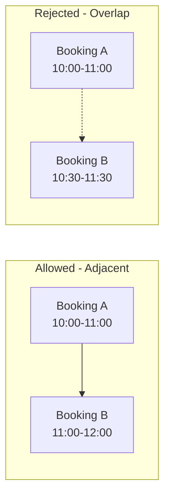

# Document Overlap Model and Add Edge Case Tests

## Time Model Overview



The overlap formula `newStart < existingEnd && newEnd > existingStart` implements half-open intervals `[start, end)` where:

- Start time is **inclusive** (the booking owns this moment)
- End time is **exclusive** (the next booking can start here)

## 1. Create Time Model Documentation ([docs/TIME_MODEL.md](docs/TIME_MODEL.md))

New file documenting:

- Half-open interval model `[start, end)`
- Why adjacent bookings are allowed
- UTC time convention
- Frontend timezone responsibility
- Visual examples of allowed vs rejected scenarios

## 2. Update JSDoc Comment ([src/services/bookingService.ts](src/services/bookingService.ts))

Enhance the `checkForOverlap` function comment to explain:

- The `[start, end)` model
- Why the formula works
- Edge case behavior
```typescript
/**
 * Check if a new booking would overlap with existing bookings for the same room.
 *
 * Uses half-open interval model [start, end):
 * - Start time is inclusive (booking owns this moment)
 * - End time is exclusive (next booking can start here)
 *
 * Overlap occurs when: newStart < existingEnd AND newEnd > existingStart
 *
 * This allows adjacent bookings (A ends at 11:00, B starts at 11:00)
 * but rejects any actual time overlap.
 *
 * @throws AppError with BOOKING_OVERLAP if overlap is detected
 */
```


## 3. Add Edge Case Tests ([tests/booking.test.ts](tests/booking.test.ts))

Add new test section "Edge Cases" within the Overlap Detection describe block:

| Test Case | Scenario | Expected |

|-----------|----------|----------|

| Adjacent bookings | A: 10:00-11:00, B: 11:00-12:00 | Allowed (already exists) |

| Exact same slot | A: 10:00-11:00, B: 10:00-11:00 | Rejected |

| 1ms before end | A: 10:00-11:00, B: 10:59:59.999-12:00 | Rejected |

| 1ms after start | A: 10:00-11:00, B: 09:00-10:00:00.001 | Rejected |

| Touching at start | A: 10:00-11:00, B: 09:00-10:00 | Allowed |

## 4. Update PROMPTIT.md ([docs/PROMPTIT.md](docs/PROMPTIT.md))

Append this prompt and response.

## Files Changed

| File | Changes |

|------|---------|

| `docs/TIME_MODEL.md` | New documentation file |

| `src/services/bookingService.ts` | Enhanced JSDoc on checkForOverlap |

| `tests/booking.test.ts` | Add edge case tests |

| `docs/PROMPTIT.md` | Add this prompt/response |